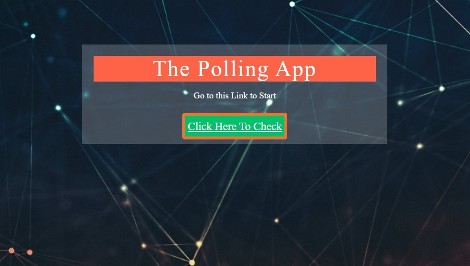
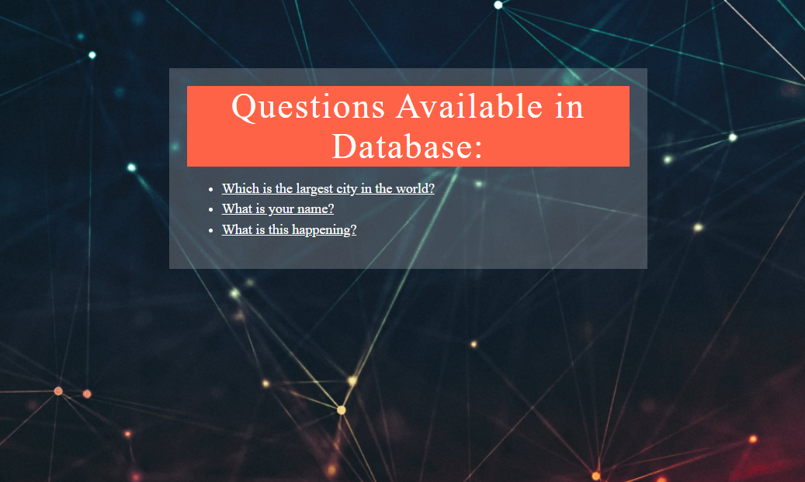
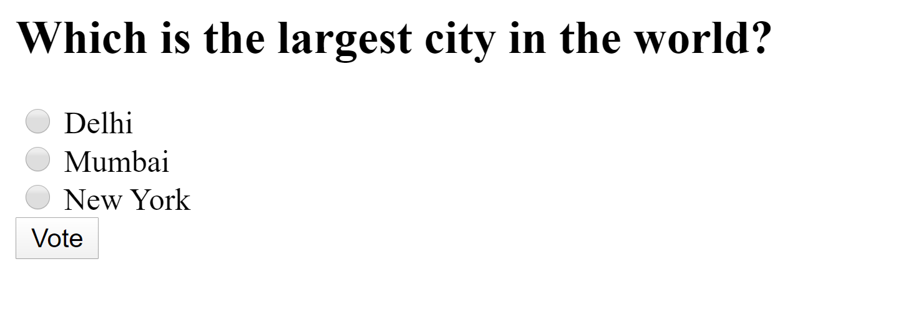
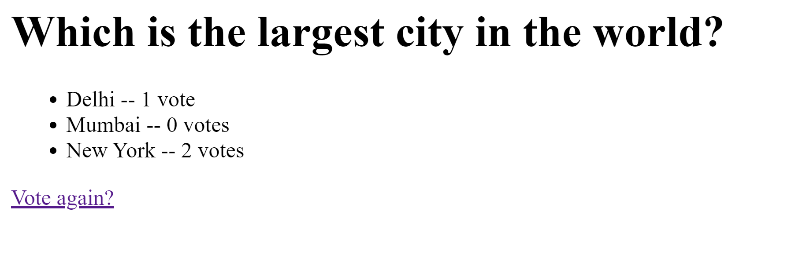

# PollsApp

### Learned From The Django Official Documentation > Tutorials
### It helps to create pages to ask for vote and opinion over set or sets of queries

### Instructions:

```
cd first
```

```
python manage.py
```









